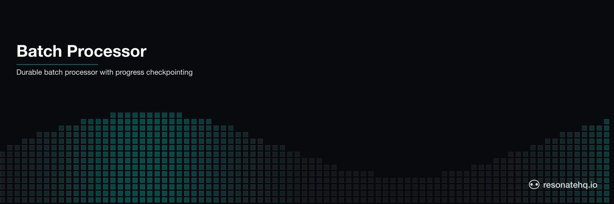

<p align="center">
  <picture>
    <source media="(prefers-color-scheme: dark)" srcset="./assets/banner-dark.png">
    <source media="(prefers-color-scheme: light)" srcset="./assets/banner-light.png">
    
  </picture>
</p>

# Batch Processor

Durable bulk import with checkpoint-based progress tracking. Splits a record set into batches and processes them sequentially. If the process crashes mid-import, it resumes from the last completed batch — not from the beginning.

## What This Demonstrates

- **Durable progress tracking**: each batch is an independent checkpoint
- **Crash recovery without reprocessing**: crash at batch 3, resume at batch 3, not batch 0
- **Idempotent batch execution**: completed batches are returned from cache on resume
- **Real-world bulk processing**: the pattern scales to 10K, 100K, or 1M records

## How It Works

Each batch is wrapped in `ctx.run()`, making it a durable checkpoint:

```typescript
for (let i = 0; i < batches.length; i++) {
  const result = yield* ctx.run(processBatchChunk, i, batch, crashAtBatch);
  batchResults.push(result);
}
```

On crash and resume, Resonate replays the workflow from the start — but each `yield*` checks the promise store first. Completed batches return their cached result immediately, without hitting the database again. The loop resumes from the first uncompleted batch.

## Prerequisites

- [Bun](https://bun.sh) v1.0+

No external services required. Resonate runs in embedded mode.

## Setup

```bash
git clone https://github.com/resonatehq-examples/example-batch-processor-ts
cd example-batch-processor-ts
bun install
```

## Run It

**Happy path** — import all 50 records in 5 batches of 10:
```bash
bun start
```

```
=== Batch Processor Demo ===
Mode: HAPPY PATH (process all records)

[processor]  Starting: 50 records → 5 batches of 10

  [batch 00] Processing 10 records...
  [batch 00] Done — 10 imported, 0 skipped
  [batch 01] Processing 10 records...
  [batch 01] Done — 10 imported, 0 skipped
  [batch 02] Processing 10 records...
  [batch 02] Done — 10 imported, 0 skipped
  [batch 03] Processing 10 records...
  [batch 03] Done — 10 imported, 0 skipped
  [batch 04] Processing 10 records...
  [batch 04] Done — 10 imported, 0 skipped

=== Result ===
{ "totalRecords": 50, "totalProcessed": 50, "batchCount": 5, "wallTimeMs": 789 }
```

**Crash mode** — DB timeout at batch 3, resumes from checkpoint:
```bash
bun start:crash
```

```
=== Batch Processor Demo ===
Mode: CRASH (process fails at batch 3, resumes from checkpoint)

[processor]  Starting: 50 records → 5 batches of 10
[processor]  Crash at batch 3, then resume

  [batch 00] Processing 10 records...
  [batch 00] Done — 10 imported, 0 skipped
  [batch 01] Processing 10 records...
  [batch 01] Done — 10 imported, 0 skipped
  [batch 02] Processing 10 records...
  [batch 02] Done — 10 imported, 0 skipped
  [batch 03] Processing 10 records...
Runtime. Function 'processBatchChunk' failed with 'Error: Batch 3 failed — simulated DB timeout' (retrying in 2 secs)
  [batch 03] Processing 10 records... (retry 2)
  [batch 03] Done — 10 imported, 0 skipped
  [batch 04] Processing 10 records...
  [batch 04] Done — 10 imported, 0 skipped

Notice: batches 0-2 each logged once (completed before crash).
Batch 3 failed → retried → succeeded.
Batches before the crash were NOT re-processed.
```

## What to Observe

1. **No re-processing**: batches 0-2 each log exactly once — in crash mode the retry only affects batch 3.
2. **Resonate's retry message**: `Runtime. Function '...' failed (retrying in N secs)` is the SDK. You don't write retry logic.
3. **The checkpoint is the loop index**: the loop counter `i` advances, and each iteration's result is independently checkpointed. Crash anywhere, resume from that exact batch.
4. **Scale this up**: change `RECORD_COUNT = 50` to `10000` — the pattern is identical. Each batch of 10 is one checkpoint.

## The Code

The workflow is 20 lines in [`src/workflow.ts`](src/workflow.ts):

```typescript
export function* importRecords(ctx: Context, records: Record[], batchSize: number, crashAtBatch: number) {
  const batches = chunkArray(records, batchSize);
  const batchResults: BatchResult[] = [];

  for (let i = 0; i < batches.length; i++) {
    const result = yield* ctx.run(processBatchChunk, i, batches[i], crashAtBatch);
    batchResults.push(result);
  }

  return { totalRecords: records.length, ...aggregate(batchResults) };
}
```

Without Resonate, this same loop would use a database cursor for progress tracking, a separate table for checkpoint state, and complex restart logic. With Resonate: `yield*` in a for-loop.

## File Structure

```
example-batch-processor-ts/
├── src/
│   ├── index.ts      Entry point — Resonate setup and demo runner
│   ├── workflow.ts   Batch workflow — loop with durable checkpoints
│   └── processor.ts  Batch step implementation and record generator
├── package.json
└── tsconfig.json
```

**Lines of code**: ~145 total, ~20 lines of workflow logic.

## Comparison

Restate's batching uses virtual objects with timer-based flush triggers (~96 LOC). Inngest event batching requires configuring batch sizes as job metadata. Both require their respective servers.

Resonate's approach: a for-loop with `ctx.run()` per batch. Crash recovery is automatic. No batching configuration, no virtual object boilerplate, no separate state store.

| | Resonate | Restate | Inngest |
|---|---|---|---|
| Checkpoint mechanism | `ctx.run()` per batch | Virtual object state | Platform-managed |
| Progress on crash | Resume from last batch | Resume from last state | Depends on config |
| Workflow code | ~20 LOC | ~96 LOC | ~40 LOC |
| Infrastructure | None | Restate server | Inngest server |

## Learn More

- [Resonate documentation](https://docs.resonatehq.io)
- [Restate batching pattern](https://github.com/restatedev/examples/tree/main/typescript/patterns-use-cases/src/batching)
- [Inngest event batching](https://www.inngest.com/docs/guides/batching)
